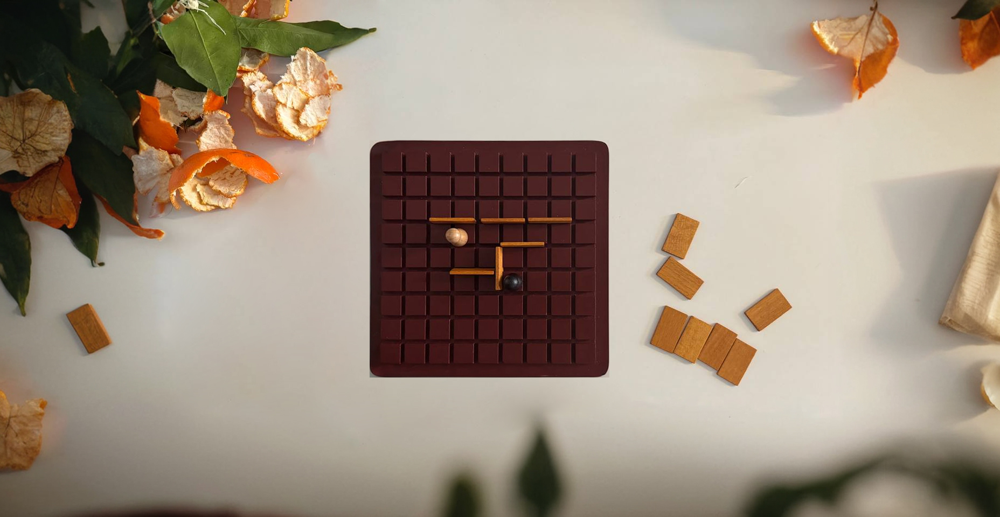

# Quoridor

Welcome to the open-source project for Quoridor, a strategic board game designed to challenge your problem-solving skills. This project is built using JavaScript and the p5.js library.

## About Quoridor

Quoridor is a 2 or 4-player intuitive strategy game where the objective is to reach the opposite side of the board before your opponents. You can either move your pawn or place walls to slow down your opponents. However, you must always leave a path open for your opponents to reach their goal.

## Technology Stack

This project is built using:

- JavaScript: The programming language used.
- p5.js: A JavaScript library that makes coding accessible for artists, designers, educators, and beginners.

## Getting Started

To get started with this project:

1. Clone the repository to your local machine.
2. Navigate to the project directory.
3. Open `index.html` in your browser to start the game.

## Contributing

We welcome contributions from everyone. Whether it's a bug report, new feature, correction, or additional documentation, we greatly value your feedback and contributions.

Please read through our contributing guide before making any contributions.

## License

This project is licensed under the MIT License. See `LICENSE` for more information.

## Contact

If you have any questions, feel free to reach out to us. We're always happy to help.

Enjoy the game!
